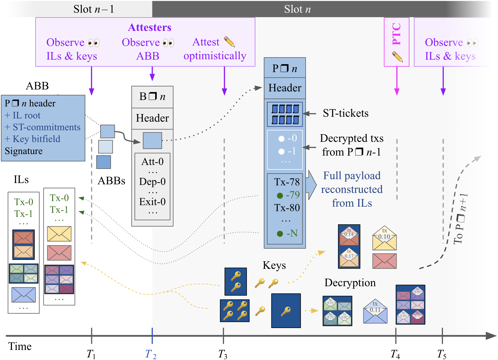

---  
eip: TBD  
title: LUCID - Encrypted Mempools with Unconditional Inclusion Lists  
description: A mechanism for pre-confirming encrypted transactions via unconditional inclusion lists, executed at the top of the subsequent block.  
author: discussions-to: https://ethereum-magicians.org/t/frame-transaction/27617  
status: Draft  
type: Standards Track  
category: Core  
created: 2026-02-04  
requires: 7732, 7805, 2718
---  

## Abstract
This proposal introduces LUCID, a protocol upgrade that implements a trustless encrypted mempool. It extends EIP-7805 (FOCIL) by allowing includers to propose Sealed Transactions (STs) that the builder must commit to in an Auditable Builder Bid (ABB).  
Includers determine the priority order of their lists, and builders are mandated to include these transactions up to a hard gas limit, providing strong censorship resistance and simplified gas accounting.

## Motivation
- MEV Protection: Transactions remain encrypted during the inclusion process, preventing front-running and sandwiching by builders.

## Specification

The key words "MUST", "MUST NOT", "REQUIRED", "SHALL", "SHALL NOT", "SHOULD", "SHOULD NOT", "RECOMMENDED", "NOT RECOMMENDED", "MAY", and "OPTIONAL" in this document are to be interpreted as described in [RFC 2119](https://www.rfc-editor.org/rfc/rfc2119) and [RFC 8174](https://www.rfc-editor.org/rfc/rfc8174).

### Constants and Parameters
| Name            |               Value                | Description                                                              | 
| --------------- | :--------------------------------: | ------------------------------------------------------------------------ | 
| `ToB_gas_limit` |                25%                 | The maximum gas allocated for decrypted transactions at the Top-of-Block | 
| `IL_gas_min`    | ToB_gas_limit // IL_COMMITTEE_SIZE | The minimum guaranteed gas per Inclusion List, calculated as             | 

### Encryption Data Structures

```python  
class SealedTransaction(Container):
   ticket: STTicket
   encrypted_tx: ByteList[MAX_ENCRYPTED_TX_BYTES]
```  

```python  
class STTicket(Container):
   from: ExecutionAddress
   nonce: uint64
   gas_limit: uint64
   max_fee_per_gas: uint64
   max_priority_fee_per_gas: uint64
   max_ranking_fee_per_gas: uint64
   decryptor_address: ExecutionAddress
   decryptor_fee: uint64
   reveal_commitment: Bytes32
   ciphertext_hash: Bytes32
   signature: Bytes65        # Signature by `from` over the ticket fields
```  

```python
class RevealedTransaction(Container):
    plaintext_tx: Transaction  # Type 2 transaction
    ToB_fee_per_gas: uint64
```

```python
class RevealCommitmentPreimage(Container):
    ticket_from: ExecutionAddress
    ticket_nonce: uint64
    plaintext_tx: Transaction
    ToB_fee_per_gas: uint64
```

### ePBS data structures

```python  
class ABB(Container) extends ExecutionPayloadBid:  
   ... fields inheretid from EIP-7732 ...   
   sealted_transactions: List[STTicket, TODO]  
```  

### FOCIL data structures

```python  
class InclusionList(Container):  
    slot: Slot    
    validator_index: ValidatorIndex    
    inclusion_list_committee_root: Root    
	transactions: List[Transaction, MAX_TRANSACTIONS_PER_PAYLOAD]
    sealed_transactions: List[SealedTransaction, TODO: static upper limit]
	key_adherence: List[ILKeyAdherence, IL_COMMITTEE_SIZE]  
```  

```python
class ILCommitments(Container):
    IL_root: Bytes32
    commits: List[STCommitment, MAX_COMMITS_PER_IL]
```

```python
class ILKeyAdherence(Container):
    key_adherence: List[Boolean, MAX_COMMITS_PER_IL]
```


TODO: repercussions for violations of any of these? Is an IL that exceeds `ToB_gas_limit` the includers fault, or the builders fault? I assume this just doesn't get attested to, and it's not a slashable offense.


### Execution Lifecycle




**Figure 1.** LUCID timeline.

Builders produce ABBs with commitments to sealed transactions. These ABBs are included in the beacon block to allow decryptors to release keys in a timely manner before the next slot starts. Transactions listed in ILs can be included in the payload by reference.

- **Before T1** – Includers propagate ILs that, besides plaintext transactions (PTs), can incorporate STs. The STs are either included individually or in a bundle (dark blue background), and can be sourced from a public encrypted mempool. Each ST consists of a signed ST ticket used for charging the sender and binding to a decryptor as well as the ciphertext `encrypted_tx` also included in the ST. The `encrypted_tx` decrypts to a signed PT that can have a different `from` field than the ST, together with a `ToB_fee_per_gas` that will be used for ordering the PT top-of-block (ToB) once decrypted. Senders encrypt transactions to the decryptor using hybrid public key encryption (HPKE) under a decryptor public key that is published out‑of‑protocol. Appendix A describes how the ILs could be staggered to achieve better coverage.
- **T1** – Attesters (purple) of slot n freeze their view of propagated ILs as well as the decryption keys for the previous block.
- **After T1** – Once builders are confident they have observed all relevant ILs and keys (those in the frozen view of most attesters), they cast [ABBs](https://ethresear.ch/t/auditable-builder-bids-with-optimistic-attestations-in-epbs/22224) (an expanded `ExecutionPayloadBid`) for the right to build the block (blue rectangles). These ABBs contain “ST-commitments” of the hash of the STs and ST bundles in the ILs. The ABB also flags observed decryption keys from the previous slot.
- **T2** – At the start of slot n, the proposer selects a winning ABB, which is at least as encompassing as its own view of required ILs and keys. It includes that ABB in the beacon block.
- **After T2** – Upon observing the ABB, nodes begin requesting any missing ILs as well as ST bytes that are referenced by the ABB’s ST‑commitments. Senders and decryptors can also independently propagate those bytes now.
- **T3** – Attesters of slot n cast a vote on the current head of the chain. If the beacon block is missing or if the included ABB fails their audit due to left out ILs or keys from their frozen view, they indicate the preceding block that is the head of the chain in their view. If the ABB passes their audit, they optimistically attest to the block.
- **After T3 (Payload release)** – The builder releases the payload. The first transactions (white rectangle) are decrypted STs, previously committed to in block n−1, ordered by their decrypted ToB fee per gas. Regular PTs from the current slot follow (black rectangle), ordered freely by the builder. The builder references the IL transactions by index into the IL instead of propagating them anew (using a separate list in the network representation).
- **After T3 (Payload reconstruction)** – Each client resolves the IL transaction references against its local cache of ILs as well as ST-commitments and assembles the full payload. It computes and verifies the payload root and proceeds to execute the payload. The STs selected by the included ABB for next-slot decryption are represented in the execution payload by a list of ST tickets, which are charged according to their full specified `gas_limit`.
- **After T3 (Key release)** – Each decryptor observes the ST-commitments in the ABB that was included in the beacon block. It confirms that the ABB has correct data for its own ST-commitment (pertaining, e.g., to its `gas_obligation` specifying how much gas it consumes), that the aggregate of all `gas_obligation` entries is within the allotted share of the next payload (`ToB_gas_limit`), and that the beacon block is attested to. It propagates the signed key(s) that reveal the STs that fit into the next block. The key(s) are flooded P2P and observed by attesters of the next block before their deadline at T5. The ToB of payload n+1 can then be constructed with the decrypted STs ordered ToB.
- **T4** – The payload timeliness committee (PTC) votes for the timeliness of the payload. Given the distributed design, the ILs carrying transactions referenced in the payload or the committed full STs/ST-bundles must by this point also have reached the PTC member for the vote to indicate a timely payload.
- **T4 or T5** – The deadline for the released keys can be enforced either by a PTC bitfield vote on their timeliness, or by attesters of slot n+1 freezing their view of the released keys and using view-merge. Attesters vote on the next ABB contingent on adherence to either the PTC bitfield vote or the frozen key view.
- **After T5** – The process follows the same trajectory as after T1 (for the previous slot). The decrypted STs from slot n are added ToB, ordered by ToB fee and charged that fee. Given that the STs are decrypted before block n is constructed, the design is fully compatible with BALs: the builder of block n+1 executes and prepares the BAL as normal.

### Rationale

- Deterministic Overflow: The rule to "remove the last added transaction" provides a deterministic method for handling congestion without complex auctions.

## Validation Rules

Attester Duties (Slot N)
- Attesters for Slot N must validate the Auditable Builder Bid (ABB) against their local view of timely Inclusion Lists (ILs).
- Gas Limit Verification: Attesters must verify that the aggregate gas_obligation of all ST-commitments in the ABB does not exceed ToB_gas_limit.
- IL Adherence (UIL Logic): Attesters verify that the builder has correctly calculated the gas_obligation for each IL.
- Deduplication Check: Attesters must verify that the builder correctly applied deterministic deduplication. If the same ST bundle appears in multiple ILs, only the bundle from the IL with the highest committee_index is retained (setting decrypt bits to 0 for lower-indexed duplicates).

Builder Duties (Slot N+1)
- Mandatory Inclusion: The builder must include transactions from valid ILs.
- Priority: The order of STTickets within an IL defines the priority.  Lower priority STTickets are at risk of truncation should `ToB_gas_limit` be exceeded.
- Overflow Handling: If the aggregate gas_obligation of all ILs exceeds ToB_gas_limit, the builder must include transactions up to the limit. The builder handles overflow by removing the last added transaction(s) until the total fits within `ToB_gas_limit`.

Block Validity (Slot N+1) A block is invalid if any of the following conditions are met:  
- ST Ticket Construction: The st_tickets list in the payload does not match the set of ST-commitments in the ABB (from Slot N) where the decrypt bit was set to 1.  
◦ Ordering: st_tickets must be ordered by scanning the ABB's IL_data by increasing committee_index, then commit_index, then tx_index.  
• Prepayment Failure: Any ticket in st_tickets fails to be fully charged. The account ticket.from must have sufficient balance to cover ticket.gas_limit * (base_fee + ToB_marginal_ranking_fee) + ticket.decryptor_fee.  
• Duplicate Decryption: The decrypted_transactions list contains more than one entry referencing the same ticket_index.  
• Invalid Ordering: decrypted_transactions are not strictly ordered by descending ToB_fee (tie-breaking by ticket_index).  
• Decryption Mismatch: A decrypted transaction does not cryptographically correspond to its ST Ticket (i.e., hash(preimage) != ticket.reveal_commitment).  
5.3. Key Release Validation (Decryptor Logic) Decryptors observe the ABB in the beacon block for Slot N. They must release keys only if:  
• The ABB specifies a correct gas_obligation for their commitment.  
• The aggregate of all obligations is ≤ ToB_gas_limit.  
• Note: This ensures that even if the payload is missed/rejected, the commitment fits in the next block for recovery.


6. Gas Accounting & Refunds  
   6.1. Static Ticket Prepayment (Start of Block Processing) Before executing any transactions, the protocol processes the st_tickets list derived from the ABB. For each ticket, the protocol strictly enforces a static prepayment to cover the maximum possible resource usage.  
   • Debit: The protocol debits the ticket.from account by:  
   Prepayment=(ticket.gas_limit×base_fee_per_gas)+ticket.decryptor_fee  
   • Validity: If the ticket.from account cannot cover this amount, the entire block is invalid.  
   • No Usage Refunds: Unlike standard Type-2 transactions, STs are charged for the full ticket.gas_limit regardless of the actual gas used during execution. This prevents users from probing the network for free by submitting transactions that revert early.  
   6.2. Decryption & Conditional Refunds After prepayment, the protocol attempts to decrypt the transactions using the keys broadcast by the decryptors.  
   • Successful Decryption:  
   ◦ The ticket.decryptor_fee (collected during prepayment) is credited to the ticket.decryptor_address.  
   • Failed Decryption:  
   ◦ The ticket.decryptor_fee is refunded to the ticket.from account.  
   ◦ Note: The cost for the gas limit (the block space occupied by the ticket) is not refunded. This ensures the sender pays for the inclusion availability even if the decryptor fails to reveal.  
   6.3. Top-of-Block (ToB) Fee & Execution Upon decryption, the plaintext RevealedTransaction exposes the ToB_fee_per_gas. This fee dictates the ordering of the transactions at the top of the block and acts as an additional cost to the sender.  
   • Additional Charge: The protocol attempts to deduct an additional fee from ticket.from:  
   ToB_Charge=ticket.gas_limit×ToB_fee_per_gas  
   • Inclusion Condition: If ticket.from has insufficient balance to cover this ToB_Charge (after the initial prepayment), the decrypted transaction is skipped (excluded from execution), though the prepayment is kept.  
   • Burning: The ToB_Charge is burned by the protocol to prevent builder-proposer collusion and to align incentives.  
   6.4. Execution Cycle
7. Ordering: Decrypted transactions are ordered strictly by ToB_fee_per_gas (descending).
8. Processing: Transactions are executed against the state.
9. Gas Consumption: Execution consumes gas from the prepaid ticket.gas_limit. Since the gas was already paid for in Section 6.1, no further ETH is deducted for base fees during this step, and no refunds are issued for unused gas

### Security Concerns

HPKE is being newly considered in this EIP, will need a broad review.

### Economic Concerns

Any new refund mechanics should be closely examined for game-ability.

